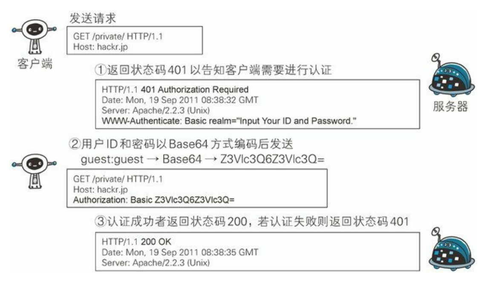
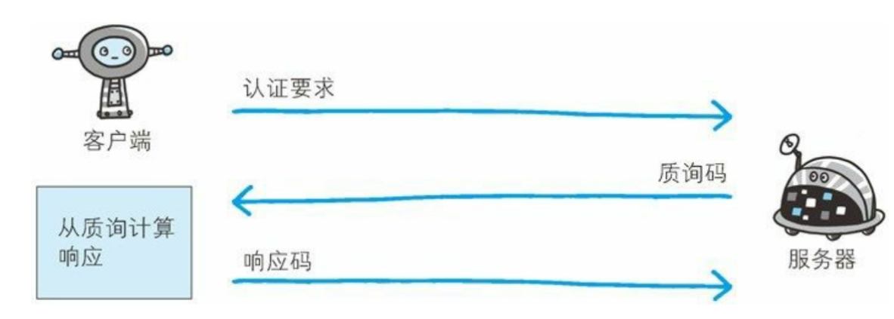
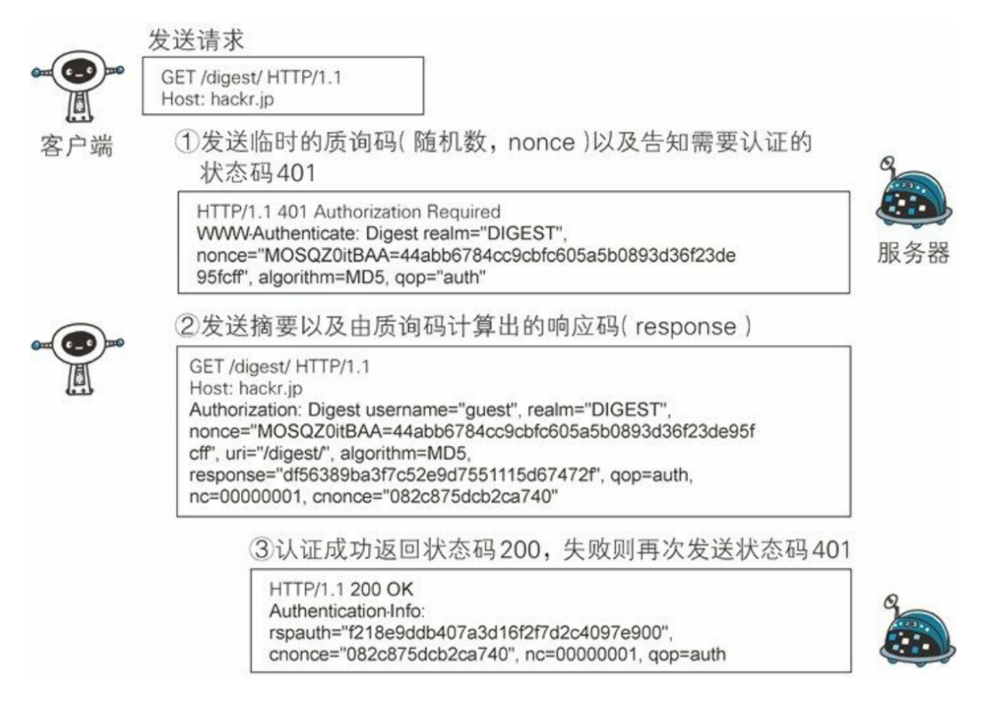
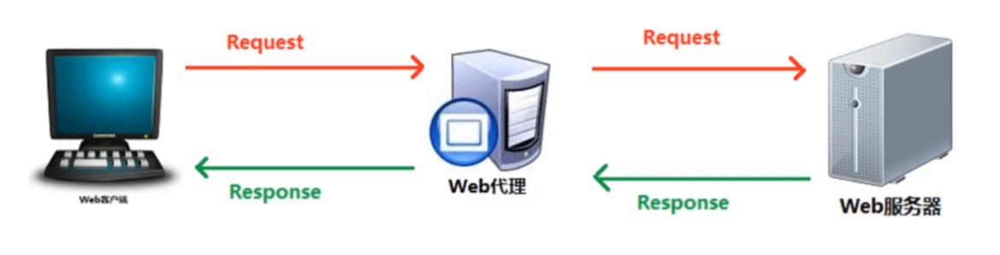

## HTTP认证

### 什么是HTTP认证

### HTTP认证的方式

HTTP认证可以分为`BASIC认证`，`DIGEST认证`，`SSL认证` 和 `FormBase` 认证

### BASIC认证

说明：BASIC 认证（基本认证）是从 HTTP/1.0 就定义的认证方式，其编码方式使用 Base64 编码

步骤：

1. 当请求的资源需要 BASIC 认证时，服务器会随状态码 401 Authorization Required，返回带 WWW-Authenticate 首部字段的响应
2. 接收到状态码 401 的客户端为了通过 BASIC 认证，需要将 用户 ID 及密码发送给服务器，发送的字符串内容是由用户 ID 和密码构成，两者中间以冒号（:）连接后，再经过 Base64 编码处理
3. 接收到包含首部字段 `Authorization` 请求的服务器，会对认证信息的正确性进行验证，如果验证通过，则返回一条包含 `Request-URI` 资源的响应



缺点：

* `BASIC` 认证虽然采用 `Base64` 编码方式，但这不是加密处理，不需要 任何附加信息即可对其解码，在 `HTTP `等非加密通信的线路上进行 BASIC 认证的过程中，如果被人窃听，被盗的可能性极高
* 如果想再进行一次 BASIC 认证时，一般的浏览器却无法实现认证注销操作

总结：`BASIC` 认证使用上不够便捷灵活，且达不到多数网站期望的安全性等级，因此它并不常用

### DIGEST认证

介绍：为弥补 BASIC 认证存在的弱点，从 HTTP/1.1 起就有了 DIGEST 认证，DIGEST 认证同样使用质询 / 响应的方式 ，但不会像 BASIC 认证那样直接发送明文密码，所谓质询响应方式是指，一开始一方会先发送认证要求给另一方，接着使用从另一方那接收到的质询码计算生成响应码。最后将响应码返 回给对方进行认证的方式



步骤：

1. 请求需认证的资源时，服务器会随着状态码 401 Authorization Required，返 回带 WWW-Authenticate 首部字段的响应，该字段内包含质问响应方式认证所需的临时质询码
2. 接收到 401 状态码的客户端，返回的响应中包含 DIGEST 认 证必须的首部字段 Authorization 信息
3. 接收到包含首部字段 Authorization 请求的服务器，会确认认证信息的正确性。认证通过后则返回包含 Request-URI 资源的响应



### SSL认证

说明：采用HTTPS开头的SSL协议进行验证，具体参考`HTTPS`一章

### FormBase认证

说明：基于表单的认证方法并不是在 HTTP 协议中定义的，客户端会向服务 器上的 Web 应用程序发送登录信息按登录信息的验证结果认证

使用：表单验证一般配合Cookie和Session使用

总结：现今最为广泛使用的验证方式


## 长连接和短连接

### 短连接

`HTTP` 协议是基于 `TCP` 协议的应用层协议，在 `HTTP/1.0` 中每当完成一次 `HTTP` 通讯，`HTTP`底层的`TCP`连接就会主动断开，这称为短连接

短连接是因为早期的网页内容简单，内容以展示性为主，不涉及频繁的交互，且当时服务器性能资源不好，主动断开连接能够减少服务器的压力

### 长连接

随者互联网的普及和发展，网页的内容更加丰富，交互更加频繁，从而`HTTP`请求响应的频率大幅度提高，如果还是采用短连接——每次通讯完就断开连接反而会很影响服务器性能和用户体验

所以从 `HTTP/1.1` 开始，所有的`TCP`连接在完成一次通讯后不会主动断开，等待下次`HTTP`通讯，直到较长时间内都没有`HTTP`通讯了，才会断开底层`TCP`连接

### HTTP/1.0使用长连接的方法

在报文首部的 `Connection` 字段中设置值 `Keep-Alive`，即 `Connection: Keep-Alive`，即可开启长连接


## HTTP代理和网关

### 代理

代理用于接收客户端请求，并把请求转发给服务端，同时代理接收服务端响应，并将其转发给客户端



常用代理工具：Fiddler

代理的作用：抓包，匿名访问，VPN

### 网关

网关用作协议转换工具中，是资源到应用程序之间的粘合剂

常见的网关类型：

* (HTTP/*)：服务器端Web网关
* (HTTP/HTTPS)：服务器安全网关
* (HTTPS/HTTP)：客户端安全加速网关
* 资源网关  


## HTTP缓存

### HTTP缓存报文首部字段

* Cache-Control

| 可选值     | 说明                                                     |
| ---------- | -------------------------------------------------------- |
| no-store   | 所有内容均不缓存                                         |
| no-cache   | 缓存，但使用缓存前都会询问服务器资源是否时最新的         |
| max-age=x  | 请求缓存后端x秒不再发起请求                              |
| s-maxage=x | 代理服务器请求源站后的x秒不要再发起请求，仅对CDN缓存有效 |
| public     | 客户端和代理服务器(CDN)均可缓存                          |
| private    | 只有客户端可以缓存                                       |

* Expires：代表资源过期时间，由服务器返回提供

* Last-Modified：资源最新修改时间，由服务器返回提供

* if-Modified-Since：资源最新修改时间，由客户端提供

* Etag：资源的标识，由服务器返回提供

* if-None-Match：资源的表示，由客户端提供

### HTTP缓存工作方式

方式1：让服务器和客户端约定一个资源过期时间——Expires

方式2：让服务器和客户端在约定资源过期时间的基础上，再加一个文件最新修改时间的对比——Last-Modified和if-Modified-Since

方式3：让服务器和客户端在过期时间Expires+Last-Modifed基础上，增加一个文件内容唯一对比标记——Etag和if-None-Match

### 缓存优化

md5/hash缓存：为静态资源添加MD5或hash标识，解决浏览器无法跳过缓存过期时间主动感知文件变化的过程

cdn缓存：通过cdn可以加速缓存

### 浏览器操作对HTTP缓存的影响

| 用户操作     | Expires/Cache-Control | Last-Modified/Etag |
| ------------ | --------------------- | ------------------ |
| 地址栏回车   | 生效                  | 生效               |
| 页面连接跳转 | 生效                  | 生效               |
| 新开窗口     | 生效                  | 生效               |
| 前进，后退   | 生效                  | 生效               |
| F5刷新       | 不生效                | 生效               |
| Ctrl+F5刷新  | 不生效                | 不生效             |


## 内容协商

### 内容协商介绍

内容协商指客户端和服务端就响应的资源进行交涉，然后提供给客户端最为适合的资源，比如网页显示的语言等等

内容协商会以响应资源的语言、字符集、编码方式等作为判断的基准

### 内容协商的方式

客户端驱动：

* 客户端发起请求，服务器发送可选项列表，客户端做出选择后发送第二次请求
* 用户体验太差，很少被使用

服务器驱动：

* 服务器检查客户端的请求投部并决定提供哪些资源
* 用户体验良好，最常使用的方式

透明协商：

* 协商过程由某个中间设备（如缓存代理，路由器等）代表客户端进行协商
* 前景不错，但目前还不普及

### 服务器协商常用报文字段

| 请求首部                                      | 响应首部                             |
| --------------------------------------------- | ------------------------------------ |
| Accept：请求服务器端发送某种媒体类型          | Content-Type：响应资源的媒体类型     |
| Accept-Language：请求服务器端发送某种语言     | Content-Language：响应资源的语言     |
| Accept-Charset：请求服务器端发送某种字符      |                                      |
| Accept-Encoding：请求服务器端发送某种编码方式 | Content-Encoding：响应资源的编码方式 |

近似匹配：在报文首部中可以指定权重，来声明优先接收哪种资源或不接收哪种资源，比如

```shell
# 优先接收中文，其次接收英文，不接收法文
Accept-Language: zh-cn;q=1.0,en:q=0.5,fr:q=0.0
```


## 断点续传

断点续传使用报文首部中的 `Range` 字段和 `Content-Range` 字段实现

### Range

客户端发送请求时对应 `Range`，指定第一个字节的位置和最后一个字节的位置

### Content-Range

服务器端响应时对应是 `Content-Range`，指定第一个字节的位置和最后一个字节的位置

### 状态码

断点续传中成功返回的状态码不是`200 OK`，而是 `206 Partial Content`

