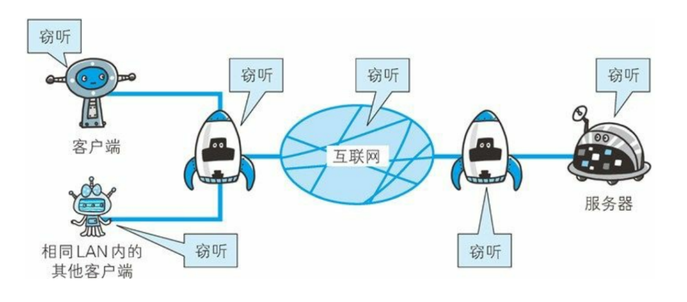
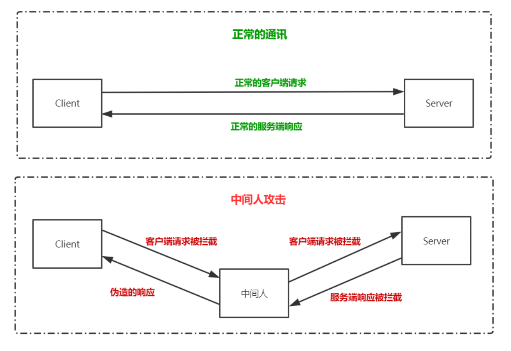
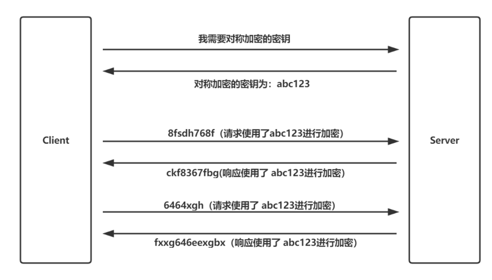
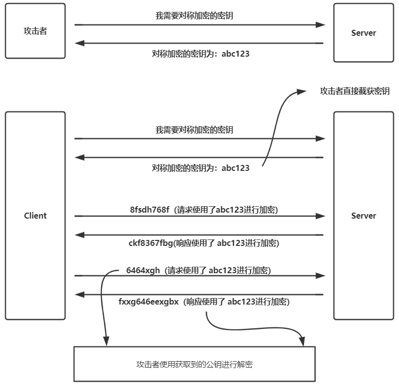
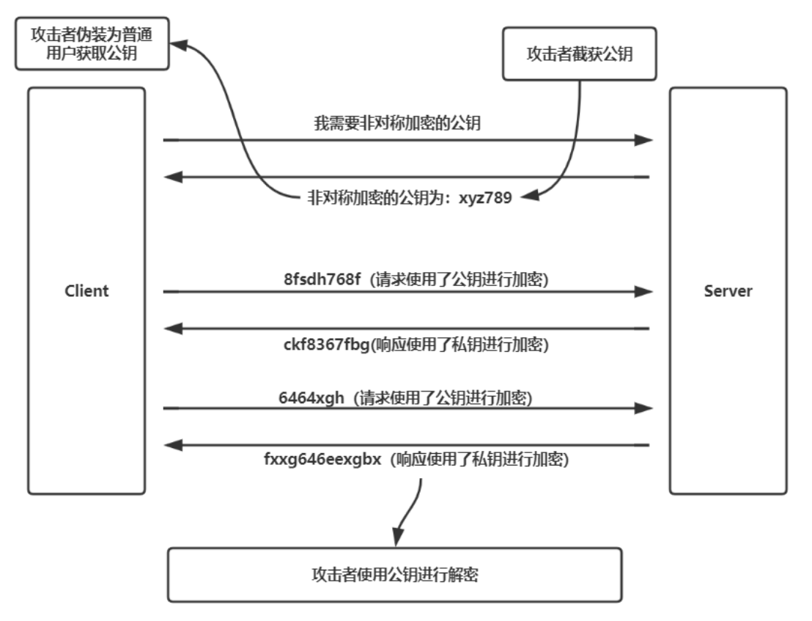
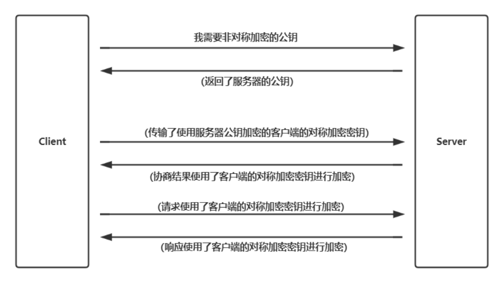
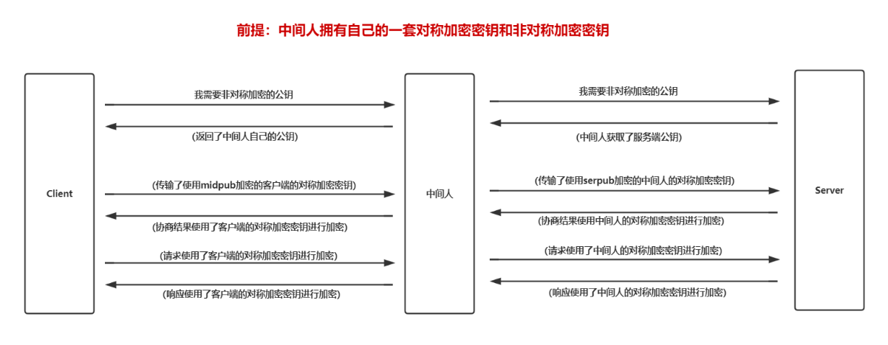
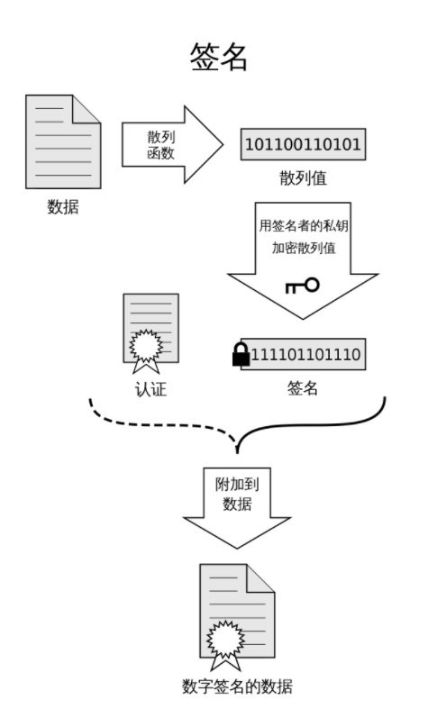
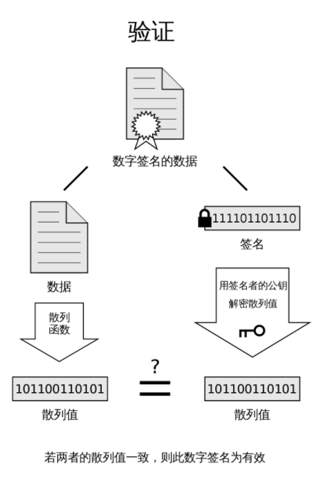
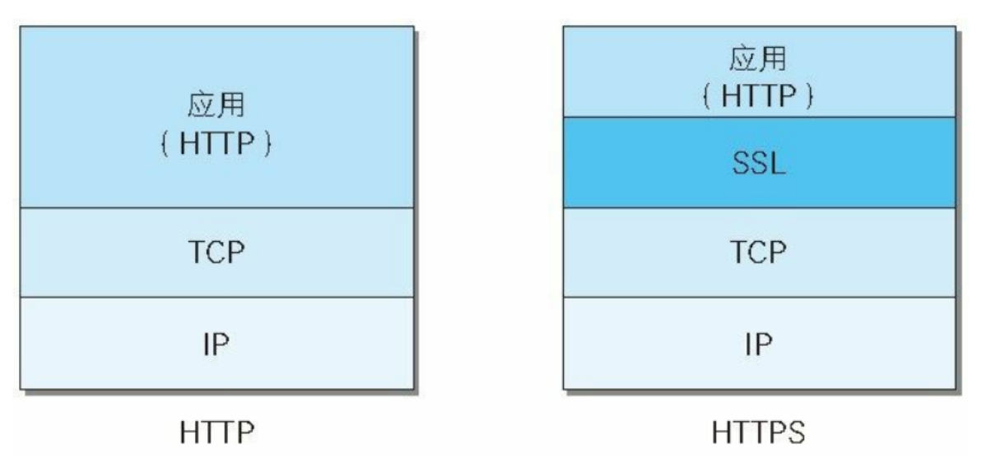

## HTTP的安全问题

### 通信使用明文可能会被窃听 

由于 HTTP 本身以明文形式传输数据，不具备加密的功能，所以也无法做到对通信整体进行加密，这可能导致在传输的过程中遭到窃听

### 不验证通信方的身份就可能遭遇伪装

HTTP协议中的请求和响应不会对通信方进行确认，也就是说存在服务器是否就是发送请求中 URI 真正指定的主机，以及返回的响应是否真的返回到实际提出请求的客户端等问题

这种不验证通信方身份的规则将可能导致**中间人攻击**

#### 中间人攻击

中间人攻击是指在客户端和服务端中间存在一个第三方（称为中间人），该中间人能窃听和篡改传输数据

* 拦截客户端的请求：对请求内容进行窃听
* 伪造请求向服务端传输内容：伪造的请求可能会被篡改，请求中可能夹带虚假危害信息
* 拦截服务端的响应：对响应内容进行窃听
* 伪造响返回给客户端：服务端响应可能会被篡改，响应中可能夹带虚假危害信息

## HTTP安全问题解决历程

### 方式1：使用对称加密

客户端首先请求服务端拿到对称加密的密钥，然后在与服务端的传输过程中，对传输的内容进行对称加密

这存在了一个很大的安全问题：因为客户端的数量是不确定，所以不可能为每个客户端都量身定制一个密钥（服务器难以维护巨量的密钥存储），所以对于不同的客户端都是使用同一个密钥，这导致攻击者有两种攻击方式：

* 攻击者伪造成普通用户去获取公钥，然后再截取其他请求响应，使用公钥进行解密窃听和篡改了
* 密钥在传输的过程中是明文传输的，攻击者也可以直接截获密钥传输的报文

### 方式2：使用非对称加密

客户端首先请求服务端获取公钥，然后客户端发送给服务端的请求使用公钥进行加密，而服务端给客户端的响应使用私钥进行加密（无法使用公钥进行加密，因为客户端没有私钥）

这其中存在了一个安全问题，攻击者可以伪造成普通用户获取公钥，也可以截获公钥，然后攻击者就可以截获服务器端的响应了（因为服务器端的响应是使用私钥进行加密的）

### 方式3：使用双向非对称加密

假设存在下面的流程

1. 某网站服务器拥有公钥A与对应的私钥A’；浏览器拥有公钥B与对应的私钥B’
2. 浏览器把公钥B明文传输给服务器
3. 服务器把公钥A明文给传输浏览
4. 之后浏览器向服务器传输的内容都用公钥A加密，服务器收到后用私钥A’解密——由于只有服务器拥有私钥A’，所以能保证这条数据的安全
5. 同理，服务器向浏览器传输的内容都用公钥B加密，浏览器收到后用私钥B’解密——同上也可以保证这条数据的安全

上述的流程看起来不错，但还是存在**中间人攻击**的风险，更重要的是非对称加密算法非常耗时，而对称加密快很多，所以HTTPS并不能采用双向非对称加密的方式

### 方式4：使用对称加密 + 非对称加密

#### 问题思考

对称加密的问题：对称密钥不安全

非对称加密的问题：服务器端返回的响应不安全

可以使用 `对称加密 + 非对称加密` 的方式解决以上问题

#### 解决思路

1. 客户端先确定一个对称加密密钥**（这一步由客户端完成，这达到了`一客户端一密钥`的策略，同时避免服务器端维护巨量密钥的压力）**
2. 客户端首先获取服务器端返回的非对称加密公钥，然后使用非对称加密公钥对第一步确定的对称加密密钥进行加密，然后传输给服务器端（这一步确保了对称加密密钥的安全）
3. 客户端和服务器端双方都使用这个对称加密密钥进行加密传输（这一步解决了非对称加密中服务器端返回的响应不安全的问题）

#### 示意图

#### 安全隐患

到目前为止，对称加密 + 非对称加密的组合看起来很完美，但还是存在安全隐患：**中间人攻击**

首先假设服务器端的非对称加密公钥：`serpub`，中间人本身拥有对称加密密钥和非对称加密密钥：`midpub`

### 方式5：对称加密 + 非对称加密 + CA

#### 问题思考

使用对称加密 + 非对称加密的问题在于客户端获取的服务器端公钥时可能遭到中间人攻击，所以问题在于如果解决服务端公钥的可信任的问题（**中间人攻击的根本原因是浏览器无法确认收到的公钥是不是服务器自己的**）

#### 解决思路

为了解决服务端公钥的可信任问题，就需要CA机构（Certificate Authority，证书颁发机构），CA机构是一个值得信任的第三方机构，CA机构维护有非对称加密的密钥（公钥和私钥）

浏览器本身**内置**大量CA机构的公钥，即客户端如果想要获取CA的公钥，可以直接查看浏览器上保存的公钥，而无需网络访问CA机构获取（防止访问过程中的中间人攻击）

CA机构可以为服务器颁发数字证书，从而保证客户端收到的公钥是来自于服务器的，而不是来自于中间人的

#### 获取证书流程

服务器想要获得证书，流程如下：

1. 服务器生成一对非对称加密用的公钥和私钥
2. CA机构先将服务器的信息（如域名，公钥信息等）使用散列函数生成对应的散列值
3. CA机构用自己的私钥对散列值加密，生成数字签名
4. CA机构将数字签名和服务器信息组合为数字证书，颁发给服务器

示意图

#### 验证流程

客户端在建立HTTP连接时，流程如下：

1. 客户端想与服务器进行通信，请求服务器，服务端把数字签名响应给客户端
2. 客户端使用保存在浏览器上的CA公钥对数字证书上的签名进行解密，得到**散列值A**
3. 客户端用证书里指明的hash算法对数字证书上服务器的信息进行散列计算，得到**散列值B**
4. 客户端将**散列值A**与**散列值B**进行对比，如果一致，则确认数字证书可靠，从而获取到服务器的公钥
5. 此后的步骤与 `对称加密 + 非对称加密` 相同

#### 中间人攻击思考

##### 中间人能伪造数字证书吗？

中间人并不能伪造数字证书，因为中间人并没有CA机构的私钥，如果中间人用自己的私钥生成数字证书，那么由于客户端（即浏览器）没有内置中间人的公钥，所以验证不会通过

##### 中间人能够调包数字证书吗？

中间人不能调包数字证书，因为数字证书上含有服务器的信息，所以并不能调包

### SSL通信和协商

客户端请求服务端获取数字证书和验证数字证书的过程称为SSL通信，目的是完成安全协商

* 客户端请求获取CA签名的报文中包含了客户端支持的SSL协议版本以及加密组件和加密算法
* 服务器端返回CA签名的报文中确认了接下来的通讯中所使用到的SSL协议版本，加密组件和加密算法

### 总结

使用 `对称加密 + 非对称加密 + CA` 的方式能够解决HTTP的安全问题，这种组合也就是`HTTPS`实现的功能

整个非对称加密过程都是为了最后的对称加密服务的，最终目的是证明证书中的公钥是安全且未篡改

HTTPS的安全风险：随意安装数字证书，即可能信赖了不安全的**"CA机构"**

## HTTPS

### 什么是HTTPS

`HTTP` + `加密和证书` 称为 `HTTP Secure`，简称 `HTTPS`，其中 `加密和证书` 统称为 `SSL协议` 或 `TLS协议`

### 为什么需要HTTPS

解决 `HTTP` 的安全问题

### HTTPS的弊端

1. 因为`HTTPS` 需要涉及加密解密与证书认证过程，所以速度和性能肯定比纯 `HTTP` 要慢，占用计算资源要更多，`HTTPS` 比 `HTTP` 要慢 2 到 100 倍，对于这种问题没有根本性的解决方案，一般会使用SSL加速器这种（专用服务器）硬件来改善

2. 服务器端请求CA机构进行签名一般是需要进行付费的，但还是存在免费的CA机构，比如 `let's encrypt` 机构

### SSL和TLS

`HTTPS `使用 `SSL`（Secure Socket Layer） 和 `TLS`（Transport Layer Security）这两个协议

`SSL` 技术最初是由浏览器开发商网景通信公司率先倡导的，开发过 `SSL3.0` 及之前的版本，目前主导权已转移到`IETF`

`IETF` 以 `SSL3.0` 为基准，后又制定了 `TLS1.0`、`TLS1.1` 和 `TLS1.2`，`TSL`协议是以 `SSL` 为原型开发的协议，有时会统一称该协议为 `SSL`，当前主流的版本是 `SSL3.0` 和 `TLS1.2`