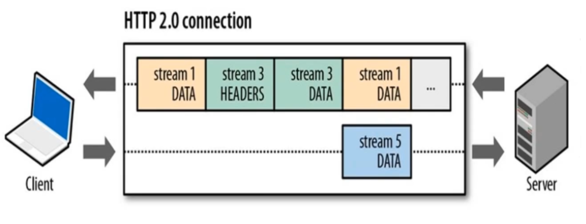

## HTTP协议瓶颈

* 一条TCP连接上只可以发送一个请求

* 请求只能从客户端开始，服务端无法主动推送信息给客户端

* 头部冗余：请求/响应首部没有经过压缩，每次互相发送相同的头部造成浪费
* 可任意选择数据压缩格式，并非强制压缩发送

## WebSocket

### WebSocket概述

WebSocket是一种支持全双工的通讯协议，支持服务器端主动给客户端发送信息

### WebSocket与HTTP的关系

WebSocket虽然说是基于HTTP协议，但实质上WebSocket只是借用了HTTP的功能来实现连接，本质上是一个全新的协议，两者的关系是**有交集**，但并非**包含**

### WebSocket建立连接

WebSocket建立连接时会使用HTTP建立连接的方法，不过对请求首部字段值有要求

| 字段                   | 要求值     |
| ---------------------- | ---------- |
| Upgrade                | websocket  |
| Connection             | Upgrade    |
| Sec-WebSocket-Key      | 固定值     |
| Sec-WebSocket-Protocol | 需要的服务 |

### WebSocket特点

* 全双工方式
* 减少通信量

### WebSocket应用

* 聊天室
* 股价行情
* 社交网络

### 实现类型WebSocket功能的方法

Ajax轮询：每隔一段时间，客户端询问服务器端有没有资源更新，询问完就关闭连接

Long Poll：客户端询问服务器端有没有资源更新，询问保持连接阻塞，直到服务器端返回

## SPDY

### SPDY重要说明

`HTTP/2.0` 基于 `SPDY` 设计，由于 `HTTP/2.0` 的出现，`Google` 已宣布不再维护和发展 `SPDY` 协议，该协议了解即可，不必深究

### SPDY概述

`SPDY` 是一个由`Google` 与 `2012` 年发布的介于 `HTTP` 协议和 `TLS` 协议之间的协议，是对 `HTTP` 协议的增强，旨在解决 `HTTP` 的性能瓶颈，缩短 `Web` 页面的加载时间

### SPDY改进

* 多路复用：在一个HTTP连接中传输更多的资源
* 支持服务器推动技术
* 压缩了HTTP头
* 支持请求优先级设置
* 强制使用 `SSL/TLS` 传输协议

## HTTP/2

### HTTP/2 概述

`HTTP/2` 是基于 `SPDY` 协议研发的

`HTTP/2` 协议没有规定必须使用 `SSL/TLS`，但 `Chorme` 和 `Firefox` 团队宣布只支持使用`SSL/TLS` 的`HTTP/2`，所以实际情况是如果想要使用 `HTTP/2`，就必须使用 `SSL/TLS`

### HTTP/2 二进制分帧层（核心功能）

`HTTP/2` 在 `HTTP` 协议和 `SSL/TLS`协议之间加了一层：二进制分帧层

在二进制分帧层中，报文首部封装为`HEADERS frame`，报文主体封装为 `DATA frame`

`HTTP/2` 中数据传输以流形式进行，传输的单位为帧

### HTTP/2 首部压缩

每次发送报文时，会保留和维护报文首部字段，在第二次发送时，只会发送发生变化的首部字段，以达到压缩首部减少首部冗余，提高传输速率的目的

### HTTP/2 多路复用

所有的`HTTP`连接共用一个`TCP`连接，一个连接对应一个流，不同流的帧在`TCP`连接上发送

优点：

* 减少服务器的连接压力，连接吞吐量变大
* 由于TCP连接减少，网络拥塞情况改善
* 慢启动时间减少，拥塞和丢包恢复速度变快

### HTTP/2 全双工传输

优点：

* 面向字节流，帧的发送可以乱序
* 并行交错发送请求，请求之间互不影响，并行交错发送响应，响应之间互不影响
* 只使用一个连接即可并行发送多个请求和响应
* 双向通信：支持服务器推送功能

### HTTP/2 流优先级设置

`HTTP/2` 中支持设置流的优先级，高优先级的流都应该优先发送，但优先级不是绝对的，不同优先级混合

### HTTP/2 缺点

RTT太多：使用 `SSL/TLS` 协议，所以握手次数会很多，即RTT会很多

丢包阻塞：因为`HTTP/2`中支持多路复用，即所有的数据流都使用同一条`TCP`连接，但当`TCP`出现丢包重传时，需要阻塞整条`TCP`连接，即会阻塞其他的数据流的传输

## QUIC与HTTP3

### 概述

`QUIC`（Quick UDP Internet Connections ）协议是由 `Google` 研发的基于 `UDP` 的网络通讯协议

`HTTP3` 协议基于 `QUIC` 协议研发

### QUIC优点

* 可以在 1 到 2 个数据包（取决于连接的服务器是新的还是已知的）内，完成连接的创建（包括 TLS）
* 因为基于 `UDP` 所以不会发生丢包阻塞的情况

### QUIC前景

目前 `QUIC` 协议并没有普及，主要有以下原因

* 部分路由封杀UDP 443端口（ 这正是QUIC 部署的端口）
* UDP包过多，由于QS限定，会被服务商误认为是攻击，UDP包被丢弃
* 无论是路由器还是防火墙目前对QUIC都还没有做好准备

