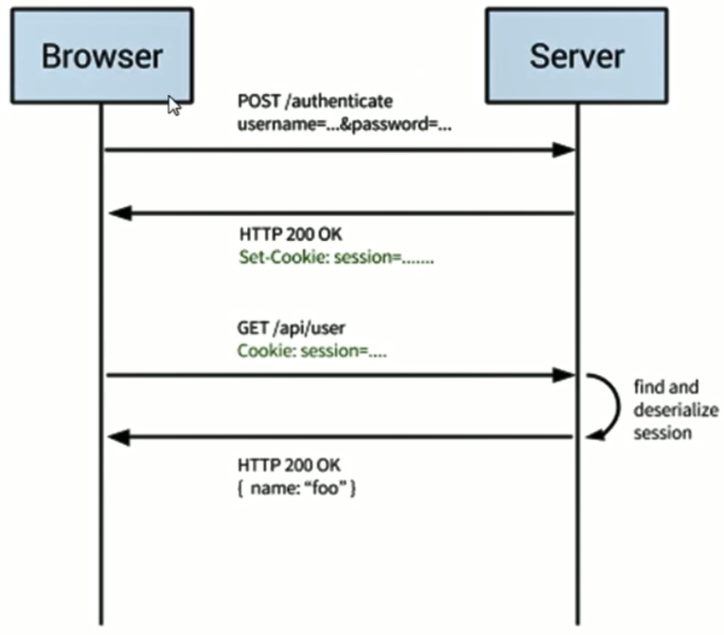
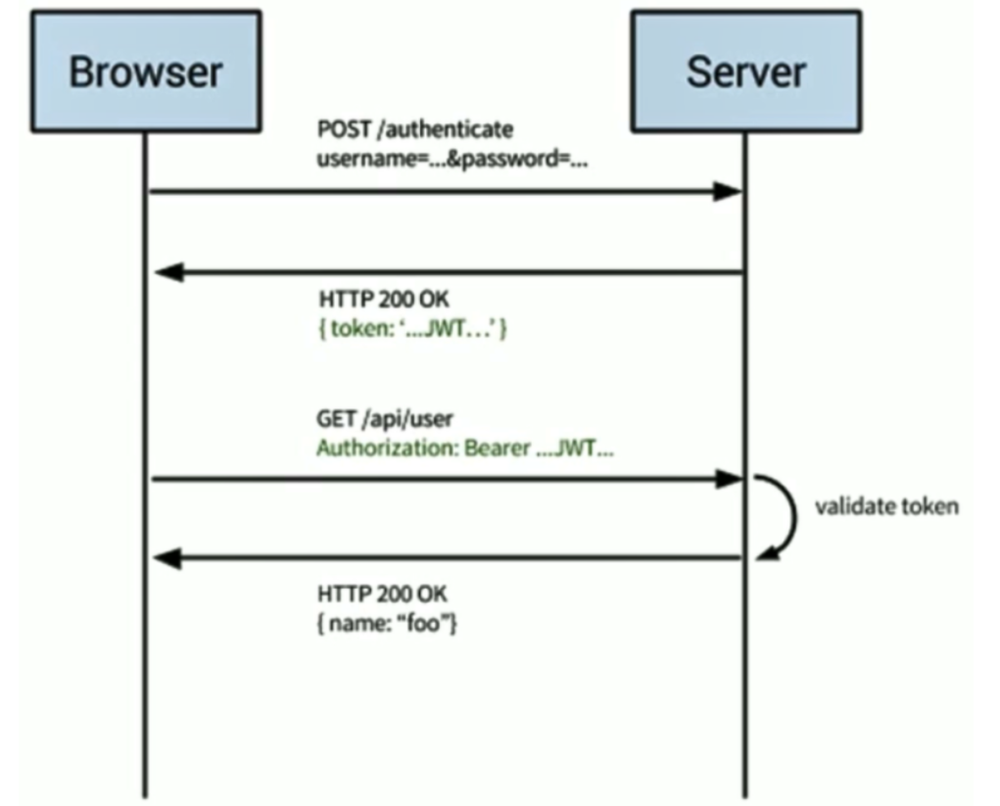

## 认证与授权

### 认证

认证是指使用用户名、密码来验证当前用户的身份

本质上就是登录，对应 401 Unauthorized

### 授权

授权是指当前用户有足够的权限访问特定资源

对应 403 Forbidden


## Session授权

### Session授权流程

#### 流程概述

```
客户端发送验证信息
  ==>
将验证信息保存到服务器会话（Session）中
  ==>
将Session的ID返回给客户端
  ==>
客户端将Session ID保存到Cookie中
  ==>
此后每次请求，客户端将Session ID一起发送给服务端
```

#### 流程图



### Session优点

* 相比于 JWT，最大的优势就是在于可以主动清除 session
* session保存到服务器端，比较安全
* 结合 cookie 使用，较为灵活，兼容性较好

### Session缺点

* cookie + session 在跨域场景下表现不好
* 如果是分布式部署，需要做多机下共享 session 机制
* 基于 cookie 的机制很容易被 CSRF 攻击
* 查询 session 信息可能会有数据库查询操作


## JWT授权

### JWT简介

* JSON Web Token
* 定义了一种紧凑且独立的方式，可以将各方之间的信息作为JSON对象进行安全传输
* 该信息是可以被验证和信任的，因为它经过了数字签名

### JWT构成

* 头部 Header
* 有效载荷 Payload
* 签名 Signature

#### Header

本质是一个JSON，有两个字段

* typ：token的类型，这里固定为 JWT

* alg：使用的 hash 算法，例如 SHA256 RSA

生成 token 前，会进行 base64的加密，示例

```js
{"alg": "HS256", "typ": "JWT"}
'eyJhbGciOiAiSFMyNTYiLCAidHIwIjogIkpXVCJ9'
```

#### Payload

存储需要传递的信息，如用户ID，用户名等

还包含元数据，比如过期时间，发布人等等

与Header不同，Payload可以进行非对称加密，示例

```js
{"user_id": "zhangsan"}
'eyJ1c2VyX2IkIjoiemhhbmdzYW4ifQ=='
'eyJ1c2VyX2IkIjoiemhhbmdzYW4ifQ'
```

#### Signature

对 Header 和 Payload 部分进行签名

保证 Token 在传输的过程中没有被篡改或损坏，示例

```js
Signature = HMACSHA256(base64UrlEncode(header) + '.' + base64UrlEncode(payload), secret)
```

### JWT工作流程

#### 流程概述

```
客户端发送验证信息
  ==>
服务端验证通过后
  ==>
生成token返回给客户端
  ==>
客户端将Session ID保存到localStorage中
  ==>
此后每次请求，客户端将token一起发送给服务端
```

#### 流程图



### JWT优点

* 无状态
* 简单，方便
* 完美支持分布式部署
* 非对称加密，Token安全性高

### JWT缺点

* 无状态，Token一旦发布则无法取消（无法解决）
* 明文传递（以base64加密），Token传输安全性低（可以使用HTTPS解决）

### JWT vs Session

* Session水平可扩展性较差，因为要考虑Session在多台服务器共享
* JWT不用浪费服务器空间资源进行存储
* RESTful要求程序是无状态的，所以用JWT
* 性能：因为 sessionid 比较小，所以传输消耗比较少，但 sessionid 需要进行数据库查询，即 JWT 是空间换时间
* 时效性：JWT只有到了过期时间才能进行销毁，而 session 可以手动进行销毁
