## TCP协议特点

| 特点       | 说明                                                         |
| ---------- | ------------------------------------------------------------ |
| 面向连接   | 应用程序在使用TCP协议之前，必须先建立TCP连接 在数据传输完毕后，必须释放已经建立的TCP连接 |
| 面向字节流 | TCP协议传输的数据以字节为单位，以流的形式传输                |
| 可靠通讯   | TCP协议能够保证传输的数据无差错，不丢失，不重复，不乱序      |
| 点对点通讯 | TCP协议就像打电话，只能一对一，不能一对多或多对多            |
| 全双工通信 | TCP协议允许双方同时接收和发送数据                            |

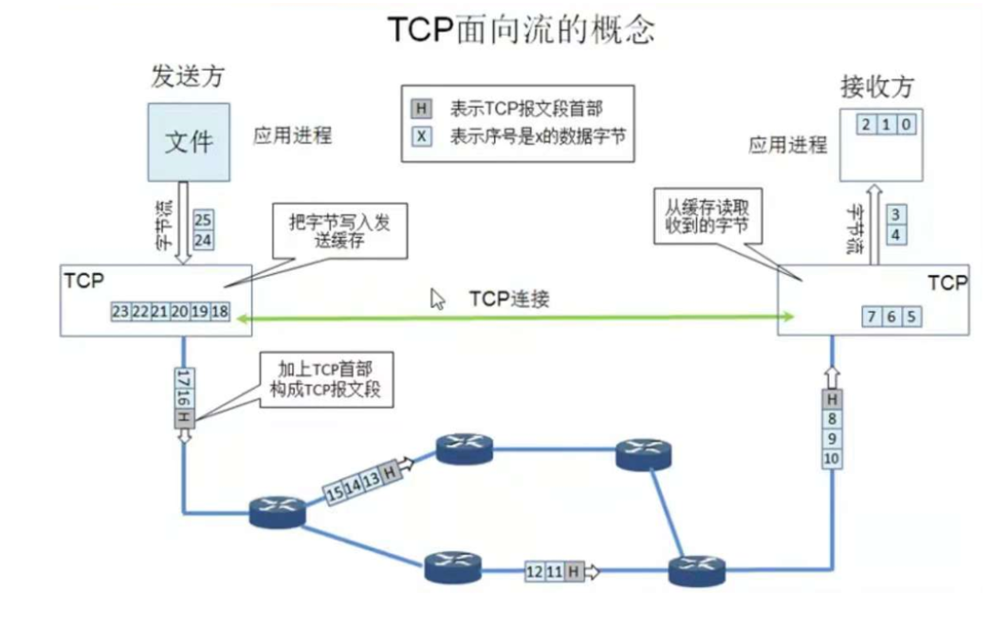

## TCP报文首部

### 报文首部结构

结构图

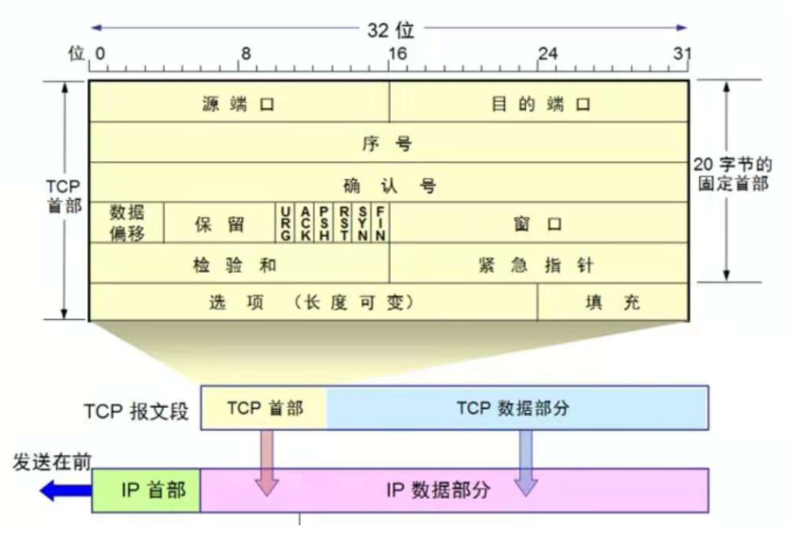

字段说明

| 字段     | 说明                                                         |
| -------- | ------------------------------------------------------------ |
| 序号     | 每个数据包的第一个字节位置在全数据中的位置                   |
| 源端口   | 发送方端口                                                   |
| 目的端口 | 接收方端口                                                   |
| 确认号   | 期待接收的下一个数据包的序号                                 |
| 数据偏移 | 指TCP报文数据部分开始位置，即TCP报文首部占用空间大小 数据偏移占4位，单位为"4字节"，即TCP报文首部最大为15*4=60字节 而TCP报文首部固定部分大小为20字节，即TCP首部可选部分最大为40字节 |
| 保留     | 保留，暂时没用                                               |
| 紧急URG  | 告诉发送发应优先发送                                         |
| 确认ACK  | ACK=1时有效，用于建立TCP连接                                 |
| 推送PUSH | 告诉接收方应优先接收                                         |
| 窗口     | 占2字节，范围[0，2^16-1]，用于TCP流量控制和拥塞控制          |
| 检验和   | 占2字节，计算检验和时，需要在TCP报文段前加上12字节的伪首部   |
| 紧急指针 | 仅在URG=1时有效，指明紧急数据的位置                          |
| 选项     | 长度可变，只有一种选项：**MSS**（Maximum Segment Size），最大报文段长度 |

### 序号示意图

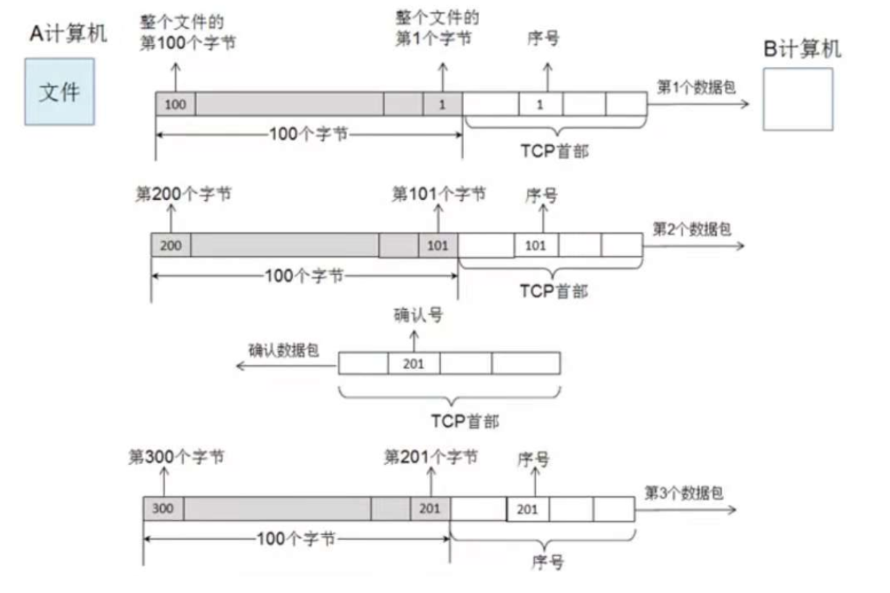

## TCP连接管理

### 三次握手

#### 示意图

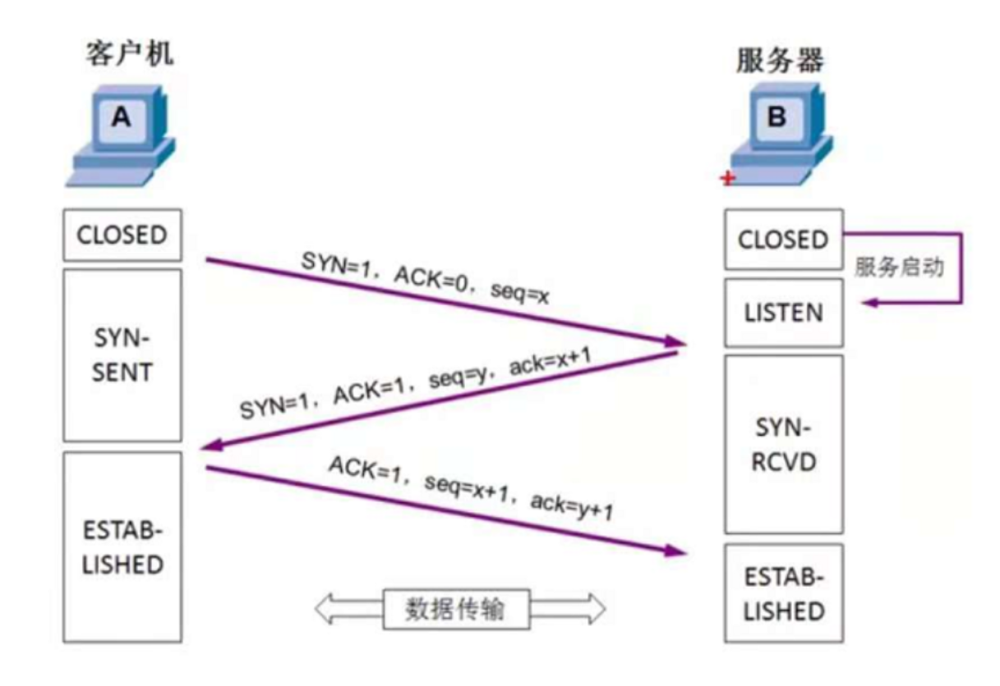

#### 为什么需要三次握手

目的是为了让客户端可服务端双方都知道 (Client ==> Server 和 Server ==> Client) 是成立，最终目的是为了保证连接是双工的

* 第一次握手：服务端知道可以接收到来自客户端的请求（服务端了解 Client ==> Server）

* 第二次握手：客户端知道服务端能够接收自己的请求（客户端了解 Client ==> Server），且自己也能接收来自服务端的响应（客户端了解 Server==>Client）

* 第三次握手：服务端知道客户端能够接收自己给它的响应（服务端了解 Server ==> Client）

### 四次挥手

#### 示意图

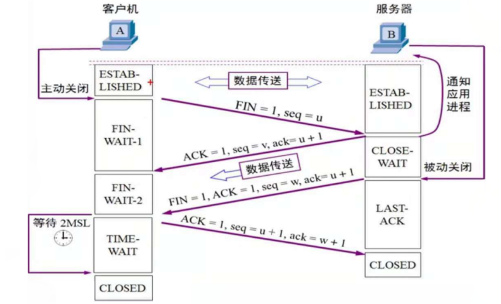

#### 为什么要等待2**MSL**（Maximum Segment Lifetime：最大报文生存时间）

目的：等待 2MSL 的目的是为了**确保被结束方关闭连接**

分析：假设第四次挥手的报文丢失，则发起方等待第三次挥手重传所需时间是：第三次挥手的超时时间+第三次挥手的传输时间，为了方便计算和程序实现，故取了最大报文时间+最大报文时间（即2MSL）

结果：发起方一旦接收到第三次挥手包，则重新等待 2MSL，如果发起方完成等待 2MSL，则说明第三次挥手报文没有重传，则有以下两种实际情况

1. 被结束方成功收到第四次挥手报文，成功完成连接的关闭
2. 被结束方提前关闭了连接，所以第三次挥手报文没有重传

以上两种情况均保证被结束方已经关闭了连接

反思：假设发起方不等待 2MSL 就关闭了连接，则如果第四次挥手报文丢失，会导致被结束方不断地重传第三次挥手报文，导致被结束方连接没有关闭

## TCP可靠通讯

### 方案1：停止等待协议

概念

* 发送方发送一个数据包，接收方接收后，返回一个确认包

* 发送方只有当收到确认包后才发送下一个数据包

* 现在已经不用这种技术，因为效率太低

丢包情况

| 情况                                     | 处理                                               |
| ---------------------------------------- | -------------------------------------------------- |
| 接收方没有受到数据包                     | 发送方超时重传                                     |
| 接收方收到数据包，但发送方没有收到确认包 | 发送方超时重传，接收方收到重复包后丢弃，返回确认包 |
| 接收方收到数据包，但发送方超时收到确认包 | 发送方超时重传，接收方收到重复包后丢弃，返回确认包 |

示意图

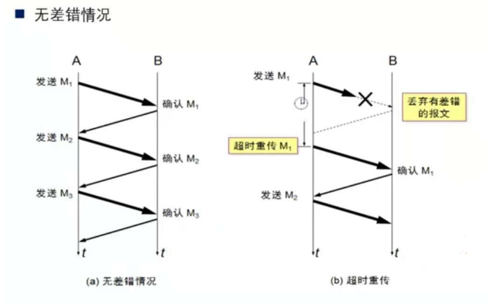

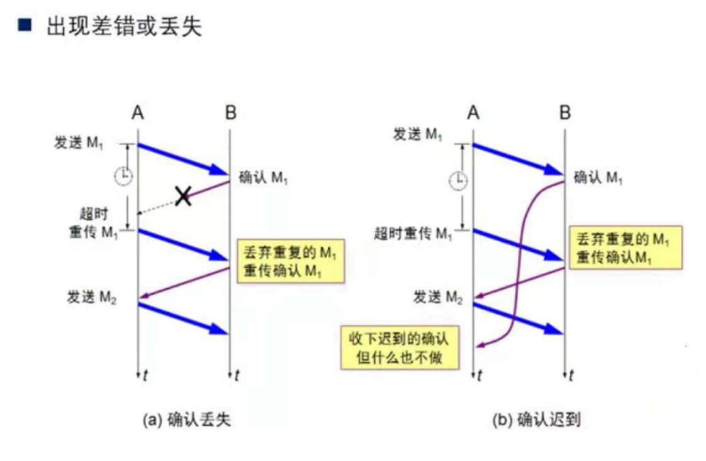

### 方案2：连续ARQ和滑动窗口协议

概念：

* 停止等待协议的改进版：一包一确认效率太低
* 核心思想：多个包分为一组，收到一个组才进行一次确认
* 一组的大小就是TCP窗口的大小
* 现在主要使用这种技术

示意图：

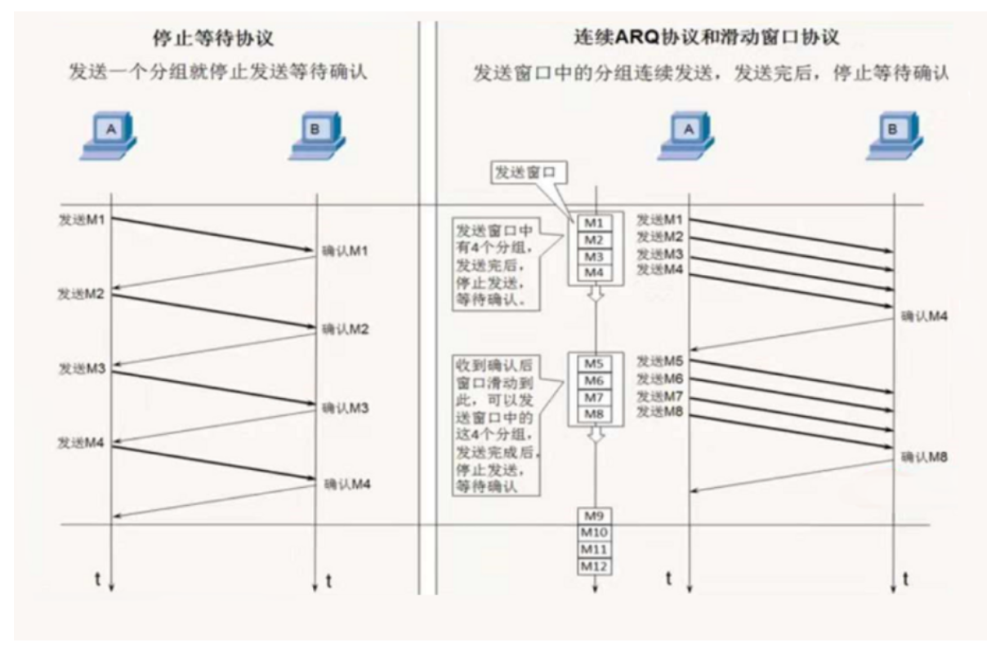

## TCP流量控制

### 概念

流量控制是指TCP连接的两端（发送方，接收方）在进行数据传输时，控制其发送和接收数据包的个数

### 核心思想

TCP协议报文有窗口，发送方叫发送窗口，接收方叫接收窗口

TCP传输过程中，发送窗口和接收窗口都会动态改变其大小，从而改变一次发送数据包的个数和一次接收数据包的个数，最终实现流量控制

### 流程图

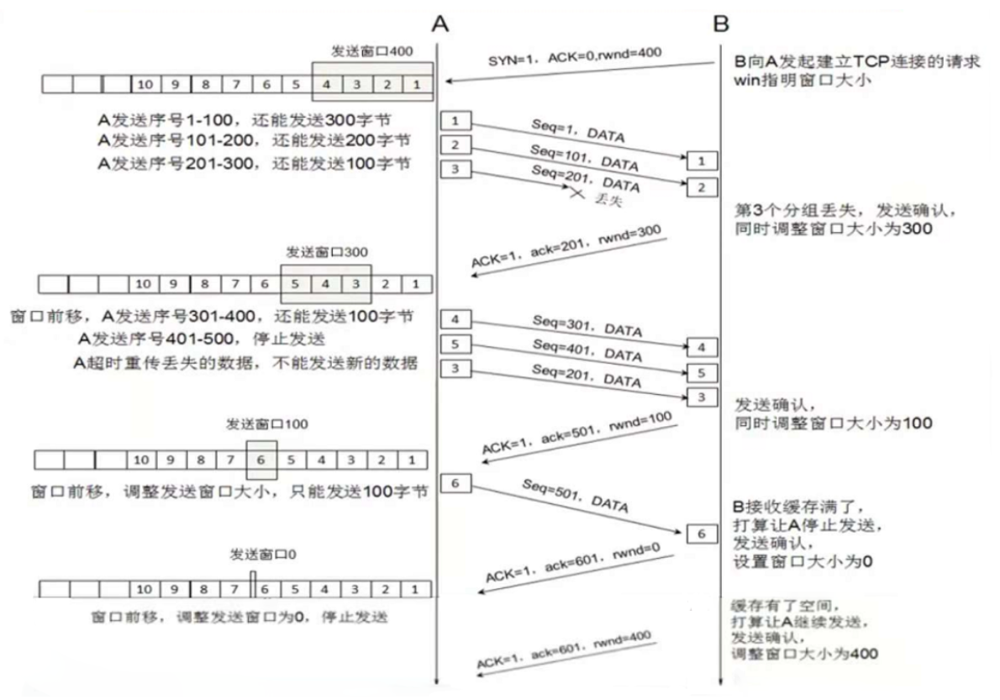

## TCP拥塞控制

### 概念

TCP拥塞控制的参与者是整个网络所有节点，所有节点共同采取措施避免网络的拥塞

### 方案1：慢开始算法

发送方在发送数据包时，一次发送的数量(**MSS**)随发送次数逐渐增多（第n次发送2^n个）

示意图

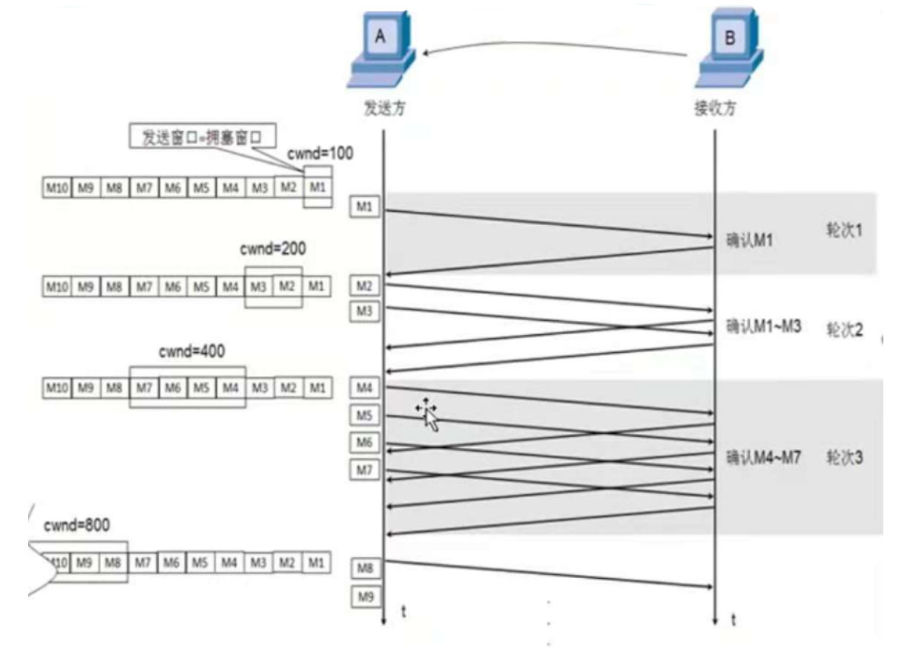

拥塞控制方式：慢开始算法

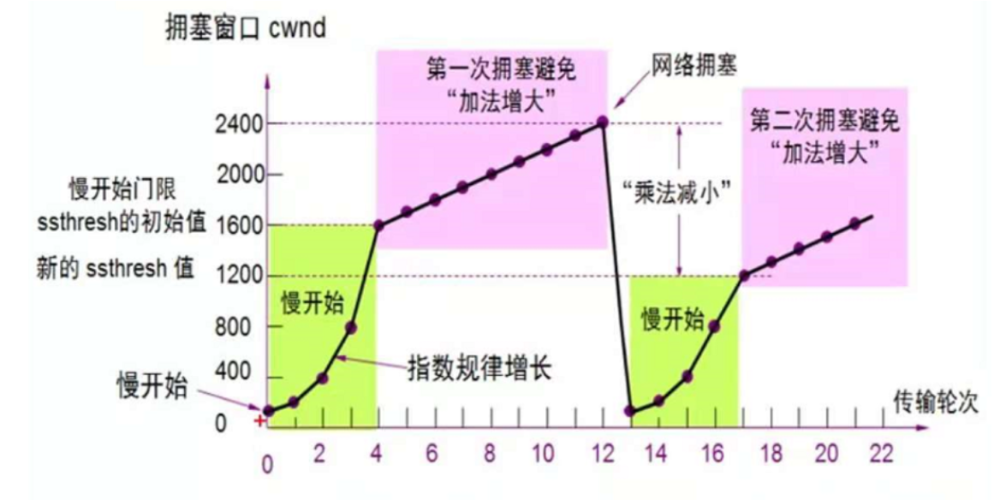

### 快重传算法

接收方每收到一个失序的分组后立即发送重复确认，这是为了使发送方能够及早知道分组没有及时到达而不要等到自己发送数据时才进行确认

快重传规定：发送方只要一连收到三个重复确认就要立即重传没有准确送达的报文段，而不要等待超时重传时间

示意图

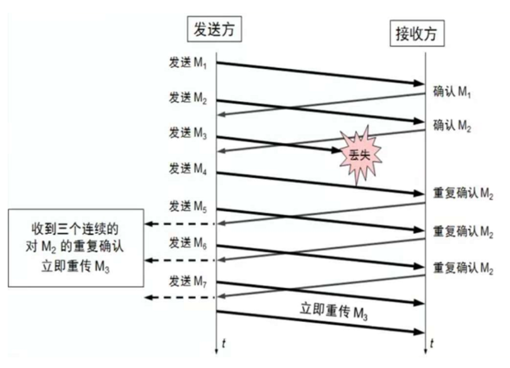

拥塞控制方式：快重传配合快恢复算法

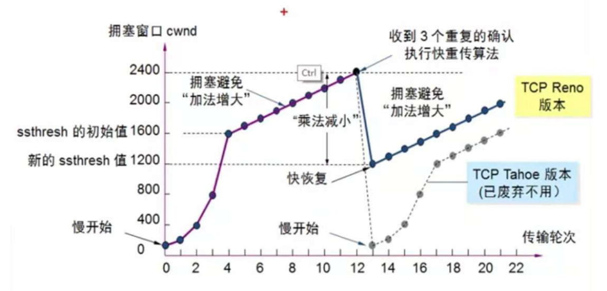

## SYN洪荒攻击

攻击者频繁地与服务器建立连接，造成服务器带宽资源与计算机资源被耗尽