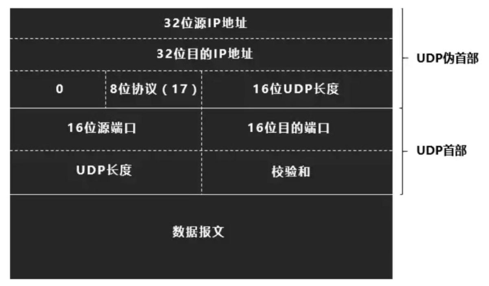

## UDP协议特点

面向无连接：发送数据前不需要建立连接

面向报文传输：支持一对一，一对多，多对多通信

不保证可靠传输：因为不建立连接

首部开销小，只占8个字节，伪首部占12字节

不具有拥塞控制功能

## UDP报文结构

## UDP校验

### 校验和计算方法

UDP包的伪首部和首部和数据报文全部按16位进行划分

然后将它们进行求和【此时参与计算的检验和为0】

然后结果取反码，得到真正的检验和

最后将其放入**检验和**中

### 校验和使用

UDP包的伪首部和首部和数据报文全部按16位进行划分

然后将它们进行求和【此时参与计算的检验和为0】

如果结果为全1，则数据传输没错，否则数据传输出错

## UDP和TCP区别

| 对比项   | TCP                | UDP        |
| -------- | ------------------ | ---------- |
| 通讯模式 | 面向连接，流模式   | 面向数据报 |
| 是否可靠 | 可靠               | 不可靠     |
| 速度     | 比较慢：要建立连接 | 比较快     |
| 资源占用 | 比较大：要维护连接 | 比较小     |
| 是否有序 | 有序               | 无序       |
| 首部开销 | 比较大：20K        | 比较小：8K |

## DDos攻击

攻击者同时发送大量的UDP包给服务器