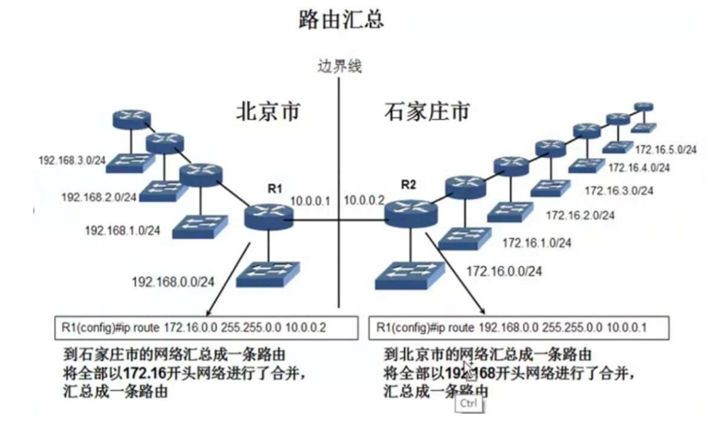
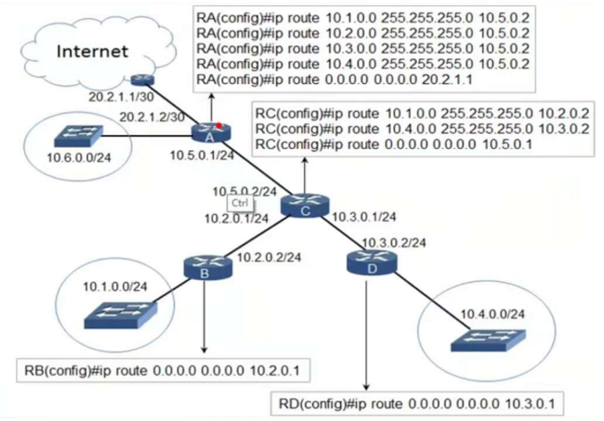
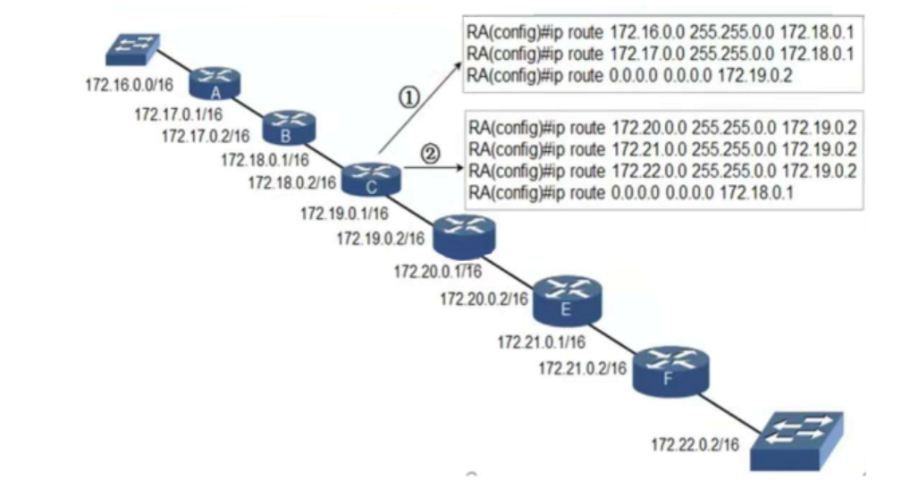
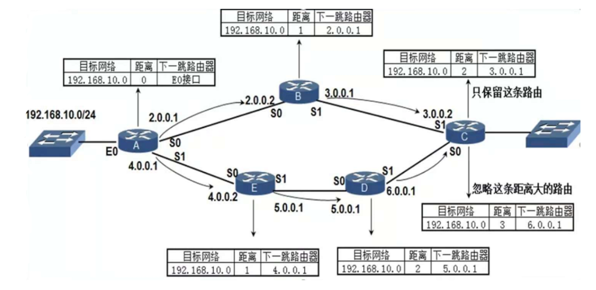

## 网络畅通的条件

数据报包有去有回，即网络中的路由器必须知道且只需要知道下一跳的地址

路由器只要知道下一跳地址就行，不必知道如何到达任意的路由器，因为如果要实现，路由表将非常非常巨大，这是不可能实现的


## 静态路由

静态路由是指网络管理员手动构建路由器的路由表，告诉路由器下一跳的地址

对于路由器，直连的网段不用加路由信息，自动识别


## 静态路由汇总

### 静态路由汇总需求分析

如果A网段和B网段都有很多的计算机，那么A网段为了与B网段联通，则需要在A网关填写B网段中所有的IP地址，则需要在B网关填写A网段中所有的IP地址，这是不实际的

比如北京市的所有计算机想要和石家庄的计算机网络连通，则北京市总路由要写石家庄网段所有的IP地址，石家庄总路由要写北京市网段所有的IP地址，这是不实际的

为了简化路由表，需要将多条路由合并为一条，为此引出静态路由汇总

### 路由汇总实现

A网关将所有去往B网段的静态路由配置为B的网关地址，B网关将所有去往A网段的静态路由配置为A的网关地址，从而实现路由汇总



匹配顺序：优先匹配子网掩码大的网段，因为掩码大的网段范围小

```
172.16.1.0 / 255.255.255.0     10.0.0.2  优先度：A
172.16.0.0 / 255.255.0.0       10.0.0.2  优先度：B
172.0.0.0  / 255.0.0.0         10.0.0.2  优先度：C
0.0.0.0    / 0.0.0.0           10.0.0.2  优先度：D
```

默认路由：最大网段：0.0.0.0 / 0.0.0.0，这个网段代表互联网






## 动态路由

### 概念

动态路由是指路由器能够自动地构建自己的路由表，并且能根据实际情况动态发生改变

### 动态路由协议 - RIP

RIP协议特点

- RIP每30秒发送一次自己的路由表，从而进行路由表更新
- 选择到达目标网络所经过路由器最少的路径为最佳路径，即最小跳数
- 默认允许的最大跳数为15跳，即认为16跳或以上的路由器是不可达的
- RIP适合小型网络，不适合大型网络

RIP工作原理



### 动态路由协议 - OSPF

- 开放最短路径协议